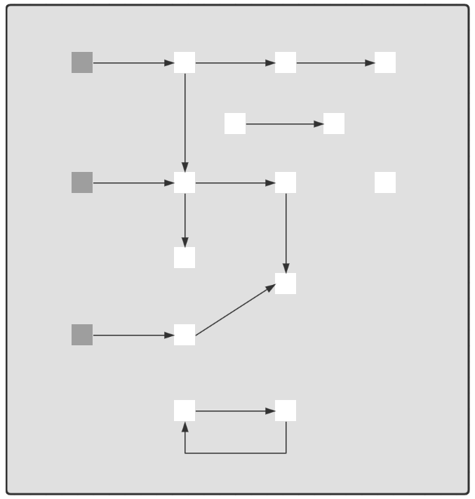
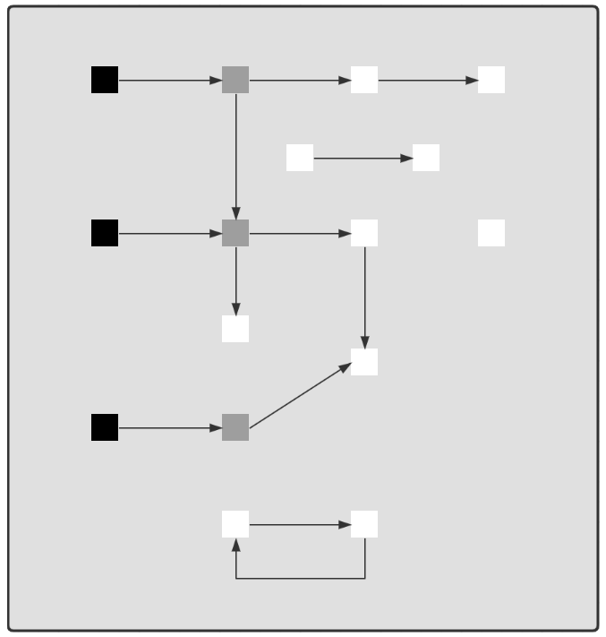
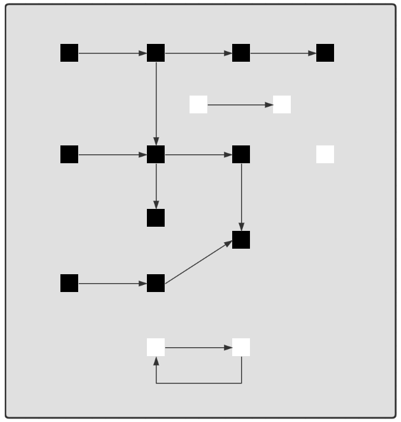

# Java虚拟机

## 01、JVM内存结构
### 结构图

### 描述
  1. 创建 JVM，调用类加载子系统加载 class，将类的信息存入**方法区**
  2. 创建 main 线程，使用的内存区域是 **JVM 虚拟机栈**，开始执行 main 方法代码
  3. 如果遇到了未见过的类，会继续触发类加载过程，同样会存入**方法区**
  4. 需要创建对象，会使用**堆**内存来存储对象
  5. 不再使用的对象，会由**垃圾回收器**在内存不足时回收其内存
  6. 调用方法时，方法内的局部变量、方法参数所使用的是  **JVM 虚拟机栈**中的栈帧内存
  7. 调用方法时，先要到**方法区**获得到该方法的字节码指令，由**解释器**将字节码指令解释为机器码执行
  8. 调用方法时，会将要执行的指令行号读到**程序计数器**，这样当发生了线程切换，恢复时就可以从中断的位置继续
  9. 对于非 java 实现的方法调用，使用内存称为**本地方法栈**（见说明）
  10. 对于热点方法调用，或者频繁的循环代码，由 **JIT 即时编译器**将这些代码编译成机器码缓存，提高执行性能
  
### 总结：
   1. JVM Stacks虚拟机栈：局部变量、方法参数等；
   2. Method Area（方法区）：类信息和方法信息；
   3. Heap（堆）：java对象信息；
   4. PC Register（程序计数器）主要是记录线程执行代码的行数
   5. Interpreter（解释器）：将字节码解释成机器码；
   6. JIT Compiler（即时编译器）：发现热点代码缓存成机器码，之后 如果再遇到直接使用；
   7. **线程私有**：程序计数器和虚拟机栈；**线程共享**：堆和方法区；
   9. 对于Oracl的Hotspot 虚拟机实现，不区分虚拟机栈和本地方法栈的。
  
### 问题：
#### 1、哪些部分会出现内存溢出？
    除了程序计数器，都会出现内存溢出；
  * 出现OutOfMemoryError的情况
    * 堆内存耗尽：对象越来越多，又一直在使用不能被垃圾回收；
    * 方法区内存耗尽：加载的类越来越多，很多框架都会在运行期间动态产生新的类；一般不太有这种情况，因为物理内存有多大，就能用多大的方法区内存；
    * 虚拟机栈累积：每个线程最多占用 1M 内存，线程个数越来越多，而又长时间运行不销毁。
  * 出现StackOverflowError的区域
    * 虚拟机栈内部：方法调用次数过多，如递归没加终止。
#### 2、方法区与永久代、元空间之间的关系
  * 方法区是JVM 规范中 **定义**  的一块内存区域，用来存储类元数据、方法字节码，即时编译器需要的信息等；
  * 永久代是Oracl的Hotspot虚拟机对JVM规范的实现（1.8之前）；
  * 元空间是Oracl的Hotspot虚拟机对JVM规范的实现（1.8之后），使用本地内存作为这些信息的存储空间；

   * 当第一次用到某个类时，由类加载器将 class 文件的类元信息读入到元空间中，并存储；
   * 图中 X，Y 的类元信息是存储在元空间中的，无法直接访问的；需要通过堆中的X.class、Y.class 间接访问类元信息，它们两个属于Java对象，代码中是可以使用的。

   * 在堆内存中，一个**类加载器对象**加载的**所有对象**，如果这些对象对应的**所有实例对象**都没有引用时，GC时就会对它们占用的堆内存进行释放；
   * 元空间中的内存释放**以类加载器为单位**，当堆中类加载器内存释放时，对应的元空间中的类元信息也会释放。
   * 在整个类加载没了，才会把元空间中的对应的类清除，自定义的类加载器才可被释放。
  
  
## 02、JVM内存参数
    先看一个问题：
    对于JVM内存配置参数：-Xmx10240m -Xms10240m -Xmn5210m -XX:SurvivorRatio=3 其最小内存值和Survivor区总大小分别是？
    答:通过 （图按大小设置） 参数了解，可以知道堆内存的最大值和最小值都为10G，新生代的内存为5G，则老年代内存也会分到5G；
       再看 (图按比例设置)参数比 和 -XX:SurvivorRatio=3 了解，eden 与 from（from和to大小一样）比为3:1，则 5120m/5=1024m，
       Survivor总大小 = 1024m*2 = 2048m = 2G。

### 参数了解
  * -Xmx 最小堆内存（包括新生代和老生代）
  * -Xms 最大堆内存（同上）
  * 一般建议 -Xms 与 -Xmx 设置为大小相等，即不需要保留内存，不需要从小到大增长，这样性能较好
  * -Xmn 新生代大小，相当于同时设置 -XX:NewSize 与 -XX:MaxNewSize 并且取值相等
     * -XX:NewSize 新生化最小值
     * -XX:MaxNewSize 新生代最大值
     * 一般不建议设置，由 JVM 自己控制
  * 如果 最大值 与 最小值 设置不一样，那它们之间有区间则称**保留**，一开始不会占用那么多内存，随着使用内存越来越多，会逐步使用这部分保留内存。
  * 如下图：  

  * 上面是**按大小设置**堆内存的参数，下图**按比例设置**

  * 如上图：**-XX:NewRatio=2:1** 表示老年代占两份，新生代占一份；**-XX:SurvivorRatio=4:1** 表示新生代分成6份，伊甸园占4份，form 和 to 各点一份。
  * **元空间内存设置**如下图：
  

  * class space： 存储类的基本信息
  * -XX:CompressedClassSpaceSize: 控制最大值
  * non-class space: 存储除类的基本信息以外的其它信息（如 方法字节码、注解等）
  * -XX:MaxMetaspaceSize：控制 class space 和 non-class space 总大小
  **注意**
  * 这里 -XX:CompressedClassSpaceSize 这段空间还与是否开启了指针压缩有关，可认为指针压缩默认开启

### 其他参数设置
* **代码缓存内存设置**

  * 使用场景在JIT 计时编译器，缓存编译后的机器码的
  * 当 -XX:ReservedCodeCacheSize < 240m 时，所有优化机器代码不加区分一起
  * 则会分成 三个区域
    * non-nmethods - JVM 自己用的代码
    * profiled nmethods - 部分优化的机器码
    * non-profiled nmethods - 完全优化的机器码
    
* **线程内存设置**

> ***官方参考文档***
>
> * https://docs.oracle.com/en/java/javase/11/tools/java.html#GUID-3B1CE181-CD30-4178-9602-230B800D4FAE

## 3. JVM 垃圾回收

**要求**

* 掌握垃圾回收算法
* 掌握分代回收思想
* 理解三色标记及漏标处理
* 了解常见垃圾回收器

**三种垃圾回收算法**

标记清除法

解释：

1. 找到 GC Root 对象，即那些一定不会被回收的对象，如正执行方法内局部变量引用的对象、静态变量引用的对象
2. 标记阶段：沿着 GC Root 对象的引用链找，直接或间接引用到的对象加上标记
3. 清除阶段：释放未加标记的对象占用的内存

要点：

* 标记速度与存活对象线性关系
* 清除速度与内存大小线性关系
* 缺点是会产生内存碎片

标记整理法

解释：

1. 前面的标记阶段、清理阶段与标记清除法类似
2. 多了一步整理的动作，将存活对象向一端移动，可以避免内存碎片产生

特点：

* 标记速度与存活对象线性关系

* 清除与整理速度与内存大小成线性关系
* 缺点是性能上较慢

标记复制法

解释：

1. 将整个内存分成两个大小相等的区域，from 和 to，其中 to 总是处于空闲，from 存储新创建的对象
2. 标记阶段与前面的算法类似
3. 在找出存活对象后，会将它们从 from 复制到 to 区域，复制的过程中自然完成了碎片整理
4. 复制完成后，交换 from 和 to 的位置即可

特点：

* 标记与复制速度与存活对象成线性关系
* 缺点是会占用成倍的空间

**GC 与分代回收算法**

GC 的目的在于实现无用对象内存自动释放，减少内存碎片、加快分配速度

GC 要点：

* 回收区域是**堆内存**，不包括虚拟机栈
* 判断无用对象，使用**可达性分析算法**，**三色标记法**标记存活对象，回收未标记对象
* GC 具体的实现称为**垃圾回收器**
* GC 大都采用了**分代回收思想**
  * 理论依据是大部分对象朝生夕灭，用完立刻就可以回收，另有少部分对象会长时间存活，每次很难回收
  * 根据这两类对象的特性将回收区域分为**新生代**和**老年代**，新生代采用标记复制法、老年代一般采用标记整理法
* 根据 GC 的规模可以分成 **Minor GC**，**Mixed GC**，**Full GC**

**分代回收**

1. 伊甸园 eden，最初对象都分配到这里，与幸存区 survivor（分成 from 和 to）合称新生代，

2. 当伊甸园内存不足，标记伊甸园与 from（现阶段没有）的存活对象

3. 将存活对象采用复制算法复制到 to 中，复制完毕后，伊甸园和 from 内存都得到释放

4. 将 from 和 to 交换位置

5. 经过一段时间后伊甸园的内存又出现不足

6. 标记伊甸园与 from（现阶段没有）的存活对象

7. 将存活对象采用复制算法复制到 to 中

8. 复制完毕后，伊甸园和 from 内存都得到释放

9. 将 from 和 to 交换位置

10. 老年代 old，当幸存区对象熬过几次回收（最多15次），晋升到老年代（幸存区内存不足或大对象会导致提前晋升）

**GC 规模**

* Minor GC 发生在新生代的垃圾回收，暂停时间短

* Mixed GC 新生代 + 老年代部分区域的垃圾回收，G1 收集器特有

* Full GC 新生代 + 老年代完整垃圾回收，暂停时间长，**应尽力避免**

**三色标记**

即用三种颜色记录对象的标记状态

* 黑色 – 已标记
* 灰色 – 标记中
* 白色 – 还未标记

1. 起始的三个对象还未处理完成，用灰色表示

2. 该对象的引用已经处理完成，用黑色表示，黑色引用的对象变为灰色

3. 依次类推

4. 沿着引用链都标记了一遍

5. 最后为标记的白色对象，即为垃圾

